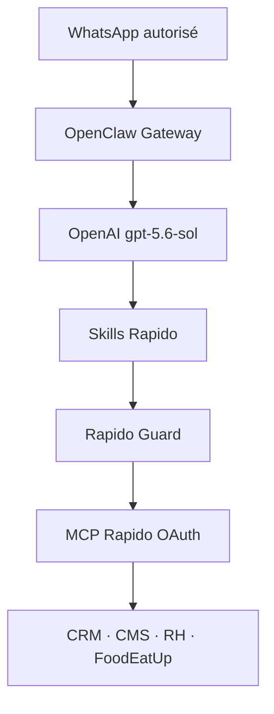

# OpenAI + OpenClaw + WhatsApp — déploiement Rapido

Statut : **adaptateur versionné, déploiement à valider d'abord en local**.

Ce dépôt est une marketplace de skills Claude-compatible. OpenClaw sait charger
ces skills et sait projeter des MCP de bundle, mais ses bundles de compatibilité
n'exécutent pas `hooks/hooks.json`. De plus, les déclarations existantes utilisent
la forme Claude `type: "http"` sans déclarer le flux OAuth OpenClaw. Cette
intégration rend donc le branchement explicite et rétablit la politique de sûreté :

1. `scripts/openclaw/generate_mcp_config.py` convertit et déduplique les MCP ;
2. `openclaw-rapido-guard/` impose les approbations côté OpenClaw.

## Flux cible



Le numéro WhatsApp n'est jamais placé dans Git. Le jeton OpenAI et les jetons
OAuth MCP ne sont jamais placés dans Git non plus.

## 1. Pré-contrôles Windows

OpenClaw a déjà besoin d'être installé et WhatsApp lié. Garder au moins **2 Go**
libres sur le disque du dépôt ; l'installateur s'arrête sinon. Le runtime de
plugin exige actuellement Node **22.22.3+**, **24.15+** ou **25.9+**. Le noyau
n'exige pas Python ; Python 3 est demandé seulement par `-Scope all` pour
convertir les déclarations optionnelles des 27 plugins.

```powershell
node --version
openclaw --version
openclaw gateway status
openclaw models status
openclaw channels status --probe
```

Si Node est encore en 22.18.0 sur cette machine :

```powershell
winget upgrade --id OpenJS.NodeJS.LTS -e
# Fermer puis rouvrir PowerShell
node --version
```

Si `models status` ne montre aucun profil OpenAI valide, lancer
`openclaw models auth login --provider openai --device-code` pour l'OAuth
ChatGPT/Codex, ou `openclaw onboard --auth-choice openai-api-key` pour un profil
API, puis revérifier. Pour un service permanent, une clé API injectée par le
gestionnaire de secrets du serveur est préférable à une session interactive. Ne
jamais coller cette clé dans un fichier du dépôt. Vérifier l'accès au modèle :

```powershell
openclaw models list --provider openai
```

L'option `-SetOpenAIModel` refuse de modifier la configuration si cette liste ne
contient pas `openai/gpt-5.6-sol` ; OpenClaw ne rétrograde pas silencieusement.

## 2. Installation locale du noyau Rapido

Dans PowerShell :

```powershell
cd C:\Users\MSI\braindcode
git clone https://github.com/PrendsTaPart/Plugin-Claude-MCP-BraindCode-.git
cd .\Plugin-Claude-MCP-BraindCode-

# Contrôle sans modification
powershell -ExecutionPolicy Bypass -File .\scripts\openclaw\install-rapido.ps1 -DryRun

# Installation noyau : skills + 4 MCP + garde-fou
powershell -ExecutionPolicy Bypass -File .\scripts\openclaw\install-rapido.ps1 `
  -Scope core `
  -SetOpenAIModel
```

Ne pas réutiliser `-ConfigureWhatsApp` si le canal est déjà correctement lié.
Pour une nouvelle installation personnelle, la forme est :

```powershell
powershell -ExecutionPolicy Bypass -File .\scripts\openclaw\install-rapido.ps1 `
  -Scope core `
  -SetOpenAIModel `
  -ConfigureWhatsApp `
  -WhatsAppNumber "+216XXXXXXXX"
```

Cette configuration impose `dmPolicy=allowlist` et `selfChatMode=true`. Utiliser
uniquement le numéro du propriétaire du compte.

## 3. OAuth MCP — étape humaine obligatoire

L'installateur ne fabrique et ne capture aucun jeton. Ouvrir chaque autorisation
dans le navigateur :

```powershell
openclaw mcp login rapidocrm
openclaw mcp login rapidocms
openclaw mcp login rapidorh
openclaw mcp login foodeatup
openclaw mcp doctor --probe
```

Le résultat attendu est `connected` pour les quatre serveurs. Une redirection
OAuth doit revenir à OpenClaw ; ne transmettre le code ou le jeton à personne.

## 4. Vérification de bout en bout dans WhatsApp

Envoyer depuis le seul numéro autorisé :

1. `Réponds exactement OPENAI-OK et donne le nom de ton modèle.`
2. `Liste mes marques RapidoCMS sans rien modifier.`
3. `Crée un brouillon RapidoCMS nommé TEST-OPENCLAW, sans le publier.`

Critères d'acceptation :

- le premier message répond via le modèle OpenAI configuré ;
- le deuxième lit une donnée réelle du compte OAuth, sans approbation d'écriture ;
- le troisième déclenche une approbation `allow-once` ou `deny` avant l'appel ;
- aucune publication n'est permise par ce test ;
- une commande inconnue sur un MCP Rapido demande aussi une approbation.

Les approbations sans route disponible sont refusées automatiquement. Pour la
première preuve, garder la **Control UI** OpenClaw ouverte : la documentation
garantit cette surface, mais ne garantit pas le routage explicite
`approvals.plugin.targets` vers WhatsApp. Si une demande et son identifiant sont
affichés dans le chat, `/approve <id> allow-once` est accepté ; sinon résoudre la
demande dans la Control UI.

Après le test, supprimer le brouillon depuis l'interface produit ou via un appel
explicitement approuvé.

## 5. Satellites et marketplace complète

Seulement après validation du noyau :

```powershell
powershell -ExecutionPolicy Bypass -File .\scripts\openclaw\install-rapido.ps1 `
  -Scope all
```

Cette commande installe les 27 plugins et tente d'enregistrer leurs MCP. Les URL
variables (`N8N_MCP_URL`, `GSC_MCP_URL`, etc.) sont ajoutées seulement si leur
variable existe. Les secrets de headers restent des références `${VARIABLE}`.
Chaque MCP OAuth additionnel doit ensuite être autorisé avec
`openclaw mcp login <nom>`.

## 6. Passage sur le serveur

Le serveur reprend exactement le même ordre :

1. sauvegarde de la configuration OpenClaw et des volumes ;
2. injection de `OPENAI_API_KEY` par le gestionnaire de secrets, jamais par Git ;
3. clone immuable du tag/commit validé de cette marketplace ;
4. exécution de l'installateur équivalent sous le compte du gateway ;
5. OAuth Rapido par l'opérateur ;
6. `plugins doctor`, `mcp doctor --probe`, puis redémarrage du gateway ;
7. test WhatsApp en lecture, puis test d'approbation d'un brouillon ;
8. exposition publique uniquement via HTTPS/reverse proxy. Le port du gateway
   reste lié à loopback ou au réseau privé.

Ne pas déployer le noyau et les 27 satellites en une seule bascule. Le noyau
validé devient le point de retour avant l'activation progressive des satellites.

## 7. Contrôles, incident et retour arrière

```powershell
openclaw plugins doctor
openclaw mcp status --verbose
openclaw mcp doctor --probe
openclaw models status
openclaw channels status --probe
openclaw gateway status
```

En cas de doute, couper d'abord l'accès aux quatre MCP ; ne pas simplement
désactiver le garde-fou tout en laissant les outils d'écriture disponibles :

```powershell
openclaw mcp unset rapidocrm
openclaw mcp unset rapidocms
openclaw mcp unset rapidorh
openclaw mcp unset foodeatup
openclaw plugins disable rapido-guard
openclaw gateway restart
```

L'installateur crée avant toute modification une copie horodatée de
`openclaw.json` dans le dossier local `.openclaw/backups/`. Pour un retrait
complet, supprimer les plugins/MCP ajoutés avec les commandes `plugins` et `mcp`
de la version OpenClaw installée, puis restaurer cette sauvegarde de
configuration.

Si le journal affiche `disk I/O error`, arrêter la procédure, libérer de l'espace
et ne supprimer aucun fichier de l'état OpenClaw. Si un redémarrage Windows
échoue avec une assertion `UV_HANDLE_CLOSING`, ne pas lancer une seconde instance
en parallèle :

```powershell
openclaw gateway stop
openclaw gateway start
openclaw gateway status --deep --require-rpc
```

Si l'arrêt échoue encore, redémarrer Windows avant de reprendre à partir du
contrôle `gateway status`; ne jamais exposer le port du gateway pour contourner
ce problème local.

## Références officielles

- OpenClaw — [bundles Claude compatibles](https://docs.openclaw.ai/plugins/bundles)
- OpenClaw — [configuration MCP](https://docs.openclaw.ai/cli/mcp)
- OpenClaw — [permissions des plugins](https://docs.openclaw.ai/plugins/plugin-permission-requests)
- OpenClaw — [canal WhatsApp](https://docs.openclaw.ai/channels/whatsapp)
- OpenAI — [MCP avec la Responses API](https://developers.openai.com/api/docs/guides/tools-connectors-mcp)
- OpenAI — [Skills](https://developers.openai.com/api/docs/guides/tools-skills)
